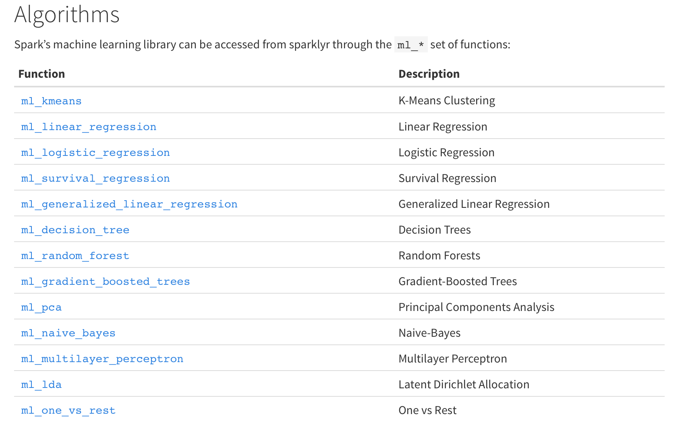

# Cinci Spark Meetup
Eugene Pyatigorsky  
`r format(Sys.time(), '%d %B, %Y')`  
------


This notebook is available on:
https://github.com/epspi/02.28.2017_Cin-Day_RUG_sparklyr

The data is available at census.gov:
https://www.census.gov/econ/cfs/pums.html

A fully instructive tutorial is at:
http://spark.rstudio.com/


## Installation & Connection
`sparklyr` and `dplyr` is what we'll be using. Install Spark directly from R with the handy `spark_install()` function within `sparklyr`

```r
if (!require(dplyr)) install.packages("dplyr")
```

```
## Loading required package: dplyr
```

```
## 
## Attaching package: 'dplyr'
```

```
## The following objects are masked from 'package:stats':
## 
##     filter, lag
```

```
## The following objects are masked from 'package:base':
## 
##     intersect, setdiff, setequal, union
```

```r
if (!require(data.table)) install.packages("data.table")
```

```
## Loading required package: data.table
```

```
## -------------------------------------------------------------------------
```

```
## data.table + dplyr code now lives in dtplyr.
## Please library(dtplyr)!
```

```
## -------------------------------------------------------------------------
```

```
## 
## Attaching package: 'data.table'
```

```
## The following objects are masked from 'package:dplyr':
## 
##     between, first, last
```

```r
if (!require(sparklyr)) install.packages("sparklyr")
```

```
## Loading required package: sparklyr
```

```r
library(dplyr)
library(data.table)
library(sparklyr)

# spark_install(version = "2.0.1")
# spark_install(version = "1.6.2")
```


  
  
You can connect to spark using the GUI or by calling `spark_connect` and specifying which version of Spark you want to use and whether you want a local or remote master. If you don't specify a version, it will default to *version 1.6.2* (as of March 2017).


  
  

```r
sc <- spark_connect(master = "local", version = "2.0.1")

# If you have port conflicts, try:
# config <- spark_config()
# config$sparklyr.gateway.port <-  5454
# sc <- spark_connect(master = "local", config = config)

sc
```

```
## $master
## [1] "local[4]"
## 
## $method
## [1] "shell"
## 
## $app_name
## [1] "sparklyr"
## 
## $config
## $config$sparklyr.cores.local
## [1] 4
## 
## $config$spark.sql.shuffle.partitions.local
## [1] 4
## 
## $config$spark.env.SPARK_LOCAL_IP.local
## [1] "127.0.0.1"
## 
## $config$sparklyr.csv.embedded
## [1] "^1.*"
## 
## $config$`sparklyr.shell.driver-class-path`
## [1] ""
## 
## attr(,"config")
## [1] "default"
## attr(,"file")
## [1] "/Library/Frameworks/R.framework/Versions/3.3/Resources/library/sparklyr/conf/config-template.yml"
## 
## $spark_home
## [1] "/Users/eugene/Library/Caches/spark/spark-2.0.1-bin-hadoop2.7"
## 
## $backend
##         description               class                mode 
## "->localhost:52883"          "sockconn"                "wb" 
##                text              opened            can read 
##            "binary"            "opened"               "yes" 
##           can write 
##               "yes" 
## 
## $monitor
##         description               class                mode 
## "->localhost:52880"          "sockconn"                "rb" 
##                text              opened            can read 
##            "binary"            "opened"               "yes" 
##           can write 
##               "yes" 
## 
## $output_file
## [1] "/var/folders/jd/l12mk78d26j7xt88r4v072w00000gn/T//Rtmp4iEQ9S/file53d4155c04a7_spark.log"
## 
## $spark_context
## <jobj[5]>
##   class org.apache.spark.SparkContext
##   org.apache.spark.SparkContext@571caff0
## 
## $java_context
## <jobj[6]>
##   class org.apache.spark.api.java.JavaSparkContext
##   org.apache.spark.api.java.JavaSparkContext@1c9669f7
## 
## $hive_context
## <jobj[9]>
##   class org.apache.spark.sql.SparkSession
##   org.apache.spark.sql.SparkSession@1ec62481
## 
## attr(,"class")
## [1] "spark_connection"       "spark_shell_connection"
## [3] "DBIConnection"
```

```r
# List of RDDs currently in the cluster
src_tbls(sc)
```

```
## character(0)
```

```r
# Web utility
spark_web(sc)
```


## Importing Data
We need to feed data into the Spark cluster, whether by copying it from R objects or by using one of the filereader functions.  

#### copy_to

```r
# Read in the text file locally and then copy_to Spark
system.time({
    ship <- fread("data/cfs_2012_pumf_csv.txt")
    ship_sp <- copy_to(sc, ship, "ship", overwrite = T)
})
```

```
## 
Read 0.0% of 4547661 rows
Read 25.9% of 4547661 rows
Read 53.2% of 4547661 rows
Read 80.5% of 4547661 rows
Read 4547661 rows and 20 (of 20) columns from 0.350 GB file in 00:00:06
```

```
##    user  system elapsed 
##  52.058   3.485  80.862
```

```r
# src_tbls(sc)
```
  
  
There are (at least) three readers for getting data *directly* into the cluster: 

* `spark_read_csv`
* `spark_read_parquet`
* `spark_read_json`


#### spark_read_csv

```r
system.time(
    ship2_sp <- spark_read_csv(sc, "ship2", 
                           "data/cfs_2012_pumf_csv.txt")
)
```

```
##    user  system elapsed 
##   0.042   0.003  31.251
```

We can't use `names` to figure out what's in the spark tables,
but `colnames` and `tbl_vars` work

```r
# colnames(ship_sp)
tbl_vars(ship2_sp)
```

```
##  [1] "SHIPMT_ID"          "ORIG_STATE"         "ORIG_MA"           
##  [4] "ORIG_CFS_AREA"      "DEST_STATE"         "DEST_MA"           
##  [7] "DEST_CFS_AREA"      "NAICS"              "QUARTER"           
## [10] "SCTG"               "MODE"               "SHIPMT_VALUE"      
## [13] "SHIPMT_WGHT"        "SHIPMT_DIST_GC"     "SHIPMT_DIST_ROUTED"
## [16] "TEMP_CNTL_YN"       "EXPORT_YN"          "EXPORT_CNTRY"      
## [19] "HAZMAT"             "WGT_FACTOR"
```

The RStudio table viewer also works on Spark tables

```r
head(ship2_sp) %>% View
```

## Manipulating Data with dplyr

You can use **some** (all?) of the dplyr verbs and also SQL commands directly on spark tables. That's basically the whole point.


```r
ship2_sp %>% count(ORIG_STATE)
```

```
## Source:   query [52 x 2]
## Database: spark connection master=local[4] app=sparklyr local=TRUE
## 
##    ORIG_STATE      n
##         <int>  <dbl>
## 1          25  97933
## 2          12 172342
## 3          13 130663
## 4          37 148681
## 5          18 141060
## 6          38  23188
## 7          56  15868
## 8          46  31072
## 9          50  22781
## 10         42 205959
## # ... with 42 more rows
```

Spark will defer calculation until you deliberately or implictely try to `collect` the data back as an R object. 


```r
head(ship2_sp)
```

```
## Source:   query [6 x 20]
## Database: spark connection master=local[4] app=sparklyr local=TRUE
## 
##   SHIPMT_ID ORIG_STATE ORIG_MA ORIG_CFS_AREA DEST_STATE DEST_MA
##       <int>      <int>   <int>         <chr>      <int>   <int>
## 1         1         25     148        25-148         25     148
## 2         2         42     428        42-428          6   41740
## 3         3         26     220        26-220         47     314
## 4         4         20     556        20-556         20     556
## 5         5         12   99999      12-99999         12   99999
## 6         6         24   47900      24-47900         30   99999
## # ... with 14 more variables: DEST_CFS_AREA <chr>, NAICS <int>,
## #   QUARTER <int>, SCTG <chr>, MODE <int>, SHIPMT_VALUE <int>,
## #   SHIPMT_WGHT <int>, SHIPMT_DIST_GC <int>, SHIPMT_DIST_ROUTED <int>,
## #   TEMP_CNTL_YN <chr>, EXPORT_YN <chr>, EXPORT_CNTRY <chr>, HAZMAT <chr>,
## #   WGT_FACTOR <dbl>
```

```r
spark_log(sc, n = 3)
```

```
## 17/03/15 22:20:04 INFO TaskSchedulerImpl: Removed TaskSet 30.0, whose tasks have all completed, from pool 
## 17/03/15 22:20:04 INFO DAGScheduler: ResultStage 30 (collect at utils.scala:195) finished in 0.009 s
## 17/03/15 22:20:04 INFO DAGScheduler: Job 18 finished: collect at utils.scala:195, took 0.015261 s
```

For example, we select some columns of interest and assign the resulting df to a new variables. However, as we see by calling `names` or `str` on the resulting variable, it's still a spark object, not a **collected** df.

```r
ship_values <- ship2_sp %>% 
    select(contains("SHIPMT"))

names(ship_values)
```

```
## [1] "src" "ops"
```

Once we ask for the contents of `ship_values`, however, an implicit collection occurs

```r
ship_values %>% head
```

```
## Source:   query [6 x 5]
## Database: spark connection master=local[4] app=sparklyr local=TRUE
## 
##   SHIPMT_ID SHIPMT_VALUE SHIPMT_WGHT SHIPMT_DIST_GC SHIPMT_DIST_ROUTED
##       <int>        <int>       <int>          <int>              <int>
## 1         1         2178          11             14                 17
## 2         2          344          11           2344               2734
## 3         3         4197        5134            470                579
## 4         4          116           6              3                  3
## 5         5          388         527            124                201
## 6         6         3716        1132           1942               2265
```

## Machine Learning

The `sparklyr` API includes interfaces to way more `Spark ML` facilities than the previous API from Spark directly.




### Regression Example

Let's try running a simple linear regression of shipment values of some other numeric variables


```r
system.time({
    lm_sp <- ship_values %>% 
    select(-SHIPMT_ID) %>% 
    ml_linear_regression(SHIPMT_VALUE ~ .)
})
```

```
## * No rows dropped by 'na.omit' call
```

```
##    user  system elapsed 
##   0.084   0.005  14.550
```


```r
system.time({
    dat <- ship %>% 
    select(contains("SHIPMT")) %>% 
    select(-SHIPMT_ID)

lm_R <- lm(SHIPMT_VALUE ~ ., data = dat)
})
```

```
##    user  system elapsed 
##   8.072   1.079   9.758
```

The output of the Spark linear regression is an object of a different type than the usual `lm` class.

```r
class(lm_sp)
```

```
## [1] "ml_model_linear_regression" "ml_model"
```

```r
class(lm_R)
```

```
## [1] "lm"
```


```r
cat("\nSpark LM Summary Output\n")
```

```
## 
## Spark LM Summary Output
```

```r
summary(lm_sp)
```

```
## Call: ml_linear_regression(., SHIPMT_VALUE ~ .)
## 
## Deviance Residuals: (approximate):
##       Min        1Q    Median        3Q       Max 
## -11584891    -13220    -12181     -8894 521254508 
## 
## Coefficients:
##                       Estimate  Std. Error  t value  Pr(>|t|)    
## (Intercept)         1.2402e+04  6.1687e+02  20.1046 < 2.2e-16 ***
## SHIPMT_WGHT         1.1866e-01  5.2415e-04 226.3765 < 2.2e-16 ***
## SHIPMT_DIST_GC     -3.5101e+01  5.9366e+00  -5.9127 3.366e-09 ***
## SHIPMT_DIST_ROUTED  3.1517e+01  4.9665e+00   6.3459 2.212e-10 ***
## ---
## Signif. codes:  0 '***' 0.001 '**' 0.01 '*' 0.05 '.' 0.1 ' ' 1
## 
## R-Squared: 0.01118
## Root Mean Squared Error: 1079000
```

```r
cat("\n\nR LM Summary Output\n")
```

```
## 
## 
## R LM Summary Output
```

```r
summary(lm_R)
```

```
## 
## Call:
## lm(formula = SHIPMT_VALUE ~ ., data = dat)
## 
## Residuals:
##       Min        1Q    Median        3Q       Max 
## -32276343    -13209    -12181     -8893 521254508 
## 
## Coefficients:
##                      Estimate Std. Error t value Pr(>|t|)    
## (Intercept)         1.240e+04  6.169e+02  20.105  < 2e-16 ***
## SHIPMT_WGHT         1.187e-01  5.242e-04 226.377  < 2e-16 ***
## SHIPMT_DIST_GC     -3.510e+01  5.937e+00  -5.913 3.37e-09 ***
## SHIPMT_DIST_ROUTED  3.152e+01  4.966e+00   6.346 2.21e-10 ***
## ---
## Signif. codes:  0 '***' 0.001 '**' 0.01 '*' 0.05 '.' 0.1 ' ' 1
## 
## Residual standard error: 1079000 on 4547657 degrees of freedom
## Multiple R-squared:  0.01118,	Adjusted R-squared:  0.01117 
## F-statistic: 1.713e+04 on 3 and 4547657 DF,  p-value: < 2.2e-16
```

The Spark machine learning output object has basically all the same values as the equivalent R object

```r
names(lm_sp)
```

```
##  [1] "features"                    "response"                   
##  [3] "intercept"                   "coefficients"               
##  [5] "standard.errors"             "t.values"                   
##  [7] "p.values"                    "explained.variance"         
##  [9] "mean.absolute.error"         "mean.squared.error"         
## [11] "r.squared"                   "root.mean.squared.error"    
## [13] "data"                        "ml.options"                 
## [15] "categorical.transformations" "model.parameters"           
## [17] ".call"                       ".model"
```

One difference is that the Spark output does not contain the original data (for good reason!), which means that there is no `plot` method defined on the object.

```r
# DOES NOT WORK!
#plot(lm_sp)

# Works but may crash anyways due to size
#plot(lm_R)
```


## More Involved Regression Example

Let's split the dataset according to origin state (`ORIG_STATE`) and fit a linear model to each subset.

### Regular R

```r
system.time({
    stateModelsR <- ship %>% 
        select(ORIG_STATE, contains("SHIPMT"), -SHIPMT_ID) %>% 
        by(., .$ORIG_STATE, . %>% {
            lm(SHIPMT_VALUE ~ . - ORIG_STATE, data = .)
        })
})
```

```
##    user  system elapsed 
##   9.184   1.792  11.759
```

```r
stateModelsR
```

```
## .$ORIG_STATE: 0
## 
## Call:
## lm(formula = SHIPMT_VALUE ~ . - ORIG_STATE, data = .)
## 
## Coefficients:
##        (Intercept)         SHIPMT_WGHT      SHIPMT_DIST_GC  
##          3455.4317              0.2394              8.9563  
## SHIPMT_DIST_ROUTED  
##            -4.0085  
## 
## -------------------------------------------------------- 
## .$ORIG_STATE: 1
## 
## Call:
## lm(formula = SHIPMT_VALUE ~ . - ORIG_STATE, data = .)
## 
## Coefficients:
##        (Intercept)         SHIPMT_WGHT      SHIPMT_DIST_GC  
##         8560.56310             0.08376           -63.52657  
## SHIPMT_DIST_ROUTED  
##           60.38119  
## 
## -------------------------------------------------------- 
## .$ORIG_STATE: 2
## 
## Call:
## lm(formula = SHIPMT_VALUE ~ . - ORIG_STATE, data = .)
## 
## Coefficients:
##        (Intercept)         SHIPMT_WGHT      SHIPMT_DIST_GC  
##          2650.4143              0.1865             26.8534  
## SHIPMT_DIST_ROUTED  
##            -2.2437  
## 
## -------------------------------------------------------- 
## .$ORIG_STATE: 4
## 
## Call:
## lm(formula = SHIPMT_VALUE ~ . - ORIG_STATE, data = .)
## 
## Coefficients:
##        (Intercept)         SHIPMT_WGHT      SHIPMT_DIST_GC  
##          1.065e+04           2.186e-02          -2.162e+01  
## SHIPMT_DIST_ROUTED  
##          2.173e+01  
## 
## -------------------------------------------------------- 
## .$ORIG_STATE: 5
## 
## Call:
## lm(formula = SHIPMT_VALUE ~ . - ORIG_STATE, data = .)
## 
## Coefficients:
##        (Intercept)         SHIPMT_WGHT      SHIPMT_DIST_GC  
##          8938.3950              0.1692           -134.8474  
## SHIPMT_DIST_ROUTED  
##           115.1486  
## 
## -------------------------------------------------------- 
## .$ORIG_STATE: 6
## 
## Call:
## lm(formula = SHIPMT_VALUE ~ . - ORIG_STATE, data = .)
## 
## Coefficients:
##        (Intercept)         SHIPMT_WGHT      SHIPMT_DIST_GC  
##          11209.491               0.596              -9.759  
## SHIPMT_DIST_ROUTED  
##              7.847  
## 
## -------------------------------------------------------- 
## .$ORIG_STATE: 8
## 
## Call:
## lm(formula = SHIPMT_VALUE ~ . - ORIG_STATE, data = .)
## 
## Coefficients:
##        (Intercept)         SHIPMT_WGHT      SHIPMT_DIST_GC  
##          5581.4673              0.0156            -28.5109  
## SHIPMT_DIST_ROUTED  
##            27.8071  
## 
## -------------------------------------------------------- 
## .$ORIG_STATE: 9
## 
## Call:
## lm(formula = SHIPMT_VALUE ~ . - ORIG_STATE, data = .)
## 
## Coefficients:
##        (Intercept)         SHIPMT_WGHT      SHIPMT_DIST_GC  
##         15483.2497              0.2207             25.2527  
## SHIPMT_DIST_ROUTED  
##           -24.2298  
## 
## -------------------------------------------------------- 
## .$ORIG_STATE: 10
## 
## Call:
## lm(formula = SHIPMT_VALUE ~ . - ORIG_STATE, data = .)
## 
## Coefficients:
##        (Intercept)         SHIPMT_WGHT      SHIPMT_DIST_GC  
##         12978.6939              0.1651            -57.9534  
## SHIPMT_DIST_ROUTED  
##            58.1950  
## 
## -------------------------------------------------------- 
## .$ORIG_STATE: 11
## 
## Call:
## lm(formula = SHIPMT_VALUE ~ . - ORIG_STATE, data = .)
## 
## Coefficients:
##        (Intercept)         SHIPMT_WGHT      SHIPMT_DIST_GC  
##         1577.98474             0.05001             1.01445  
## SHIPMT_DIST_ROUTED  
##           -1.27425  
## 
## -------------------------------------------------------- 
## .$ORIG_STATE: 12
## 
## Call:
## lm(formula = SHIPMT_VALUE ~ . - ORIG_STATE, data = .)
## 
## Coefficients:
##        (Intercept)         SHIPMT_WGHT      SHIPMT_DIST_GC  
##          6096.8444              0.1404             -7.6920  
## SHIPMT_DIST_ROUTED  
##             8.6838  
## 
## -------------------------------------------------------- 
## .$ORIG_STATE: 13
## 
## Call:
## lm(formula = SHIPMT_VALUE ~ . - ORIG_STATE, data = .)
## 
## Coefficients:
##        (Intercept)         SHIPMT_WGHT      SHIPMT_DIST_GC  
##          1.562e+04           3.584e-02          -8.319e+01  
## SHIPMT_DIST_ROUTED  
##          7.088e+01  
## 
## -------------------------------------------------------- 
## .$ORIG_STATE: 15
## 
## Call:
## lm(formula = SHIPMT_VALUE ~ . - ORIG_STATE, data = .)
## 
## Coefficients:
##        (Intercept)         SHIPMT_WGHT      SHIPMT_DIST_GC  
##          1444.6610              0.3381            -22.4592  
## SHIPMT_DIST_ROUTED  
##            22.3596  
## 
## -------------------------------------------------------- 
## .$ORIG_STATE: 16
## 
## Call:
## lm(formula = SHIPMT_VALUE ~ . - ORIG_STATE, data = .)
## 
## Coefficients:
##        (Intercept)         SHIPMT_WGHT      SHIPMT_DIST_GC  
##          2031.3829              0.2086            -24.7306  
## SHIPMT_DIST_ROUTED  
##            26.8440  
## 
## -------------------------------------------------------- 
## .$ORIG_STATE: 17
## 
## Call:
## lm(formula = SHIPMT_VALUE ~ . - ORIG_STATE, data = .)
## 
## Coefficients:
##        (Intercept)         SHIPMT_WGHT      SHIPMT_DIST_GC  
##          1.054e+04           7.659e-02          -3.953e+01  
## SHIPMT_DIST_ROUTED  
##          3.801e+01  
## 
## -------------------------------------------------------- 
## .$ORIG_STATE: 18
## 
## Call:
## lm(formula = SHIPMT_VALUE ~ . - ORIG_STATE, data = .)
## 
## Coefficients:
##        (Intercept)         SHIPMT_WGHT      SHIPMT_DIST_GC  
##         8851.45053             0.05108           -53.43848  
## SHIPMT_DIST_ROUTED  
##           50.44371  
## 
## -------------------------------------------------------- 
## .$ORIG_STATE: 19
## 
## Call:
## lm(formula = SHIPMT_VALUE ~ . - ORIG_STATE, data = .)
## 
## Coefficients:
##        (Intercept)         SHIPMT_WGHT      SHIPMT_DIST_GC  
##           3979.182               0.264              34.823  
## SHIPMT_DIST_ROUTED  
##            -20.967  
## 
## -------------------------------------------------------- 
## .$ORIG_STATE: 20
## 
## Call:
## lm(formula = SHIPMT_VALUE ~ . - ORIG_STATE, data = .)
## 
## Coefficients:
##        (Intercept)         SHIPMT_WGHT      SHIPMT_DIST_GC  
##          5093.6618              0.1449            -37.8958  
## SHIPMT_DIST_ROUTED  
##            39.3717  
## 
## -------------------------------------------------------- 
## .$ORIG_STATE: 21
## 
## Call:
## lm(formula = SHIPMT_VALUE ~ . - ORIG_STATE, data = .)
## 
## Coefficients:
##        (Intercept)         SHIPMT_WGHT      SHIPMT_DIST_GC  
##          1.199e+04           2.146e-02          -8.099e+01  
## SHIPMT_DIST_ROUTED  
##          7.568e+01  
## 
## -------------------------------------------------------- 
## .$ORIG_STATE: 22
## 
## Call:
## lm(formula = SHIPMT_VALUE ~ . - ORIG_STATE, data = .)
## 
## Coefficients:
##        (Intercept)         SHIPMT_WGHT      SHIPMT_DIST_GC  
##          8067.3459              0.2773             60.5925  
## SHIPMT_DIST_ROUTED  
##           -41.9910  
## 
## -------------------------------------------------------- 
## .$ORIG_STATE: 23
## 
## Call:
## lm(formula = SHIPMT_VALUE ~ . - ORIG_STATE, data = .)
## 
## Coefficients:
##        (Intercept)         SHIPMT_WGHT      SHIPMT_DIST_GC  
##         -570239.37               41.85             1281.16  
## SHIPMT_DIST_ROUTED  
##            -906.25  
## 
## -------------------------------------------------------- 
## .$ORIG_STATE: 24
## 
## Call:
## lm(formula = SHIPMT_VALUE ~ . - ORIG_STATE, data = .)
## 
## Coefficients:
##        (Intercept)         SHIPMT_WGHT      SHIPMT_DIST_GC  
##         6374.38835             0.01736           -14.13558  
## SHIPMT_DIST_ROUTED  
##           15.59272  
## 
## -------------------------------------------------------- 
## .$ORIG_STATE: 25
## 
## Call:
## lm(formula = SHIPMT_VALUE ~ . - ORIG_STATE, data = .)
## 
## Coefficients:
##        (Intercept)         SHIPMT_WGHT      SHIPMT_DIST_GC  
##          5872.3074              0.1804            -18.6932  
## SHIPMT_DIST_ROUTED  
##            18.9508  
## 
## -------------------------------------------------------- 
## .$ORIG_STATE: 26
## 
## Call:
## lm(formula = SHIPMT_VALUE ~ . - ORIG_STATE, data = .)
## 
## Coefficients:
##        (Intercept)         SHIPMT_WGHT      SHIPMT_DIST_GC  
##          1.417e+04           1.615e-02          -2.317e+01  
## SHIPMT_DIST_ROUTED  
##          1.975e+01  
## 
## -------------------------------------------------------- 
## .$ORIG_STATE: 27
## 
## Call:
## lm(formula = SHIPMT_VALUE ~ . - ORIG_STATE, data = .)
## 
## Coefficients:
##        (Intercept)         SHIPMT_WGHT      SHIPMT_DIST_GC  
##          6497.6986              0.0305            -24.4557  
## SHIPMT_DIST_ROUTED  
##            25.0237  
## 
## -------------------------------------------------------- 
## .$ORIG_STATE: 28
## 
## Call:
## lm(formula = SHIPMT_VALUE ~ . - ORIG_STATE, data = .)
## 
## Coefficients:
##        (Intercept)         SHIPMT_WGHT      SHIPMT_DIST_GC  
##         -1.065e+05           5.256e+00           1.898e+03  
## SHIPMT_DIST_ROUTED  
##         -1.575e+03  
## 
## -------------------------------------------------------- 
## .$ORIG_STATE: 29
## 
## Call:
## lm(formula = SHIPMT_VALUE ~ . - ORIG_STATE, data = .)
## 
## Coefficients:
##        (Intercept)         SHIPMT_WGHT      SHIPMT_DIST_GC  
##          -6281.897               1.636             537.586  
## SHIPMT_DIST_ROUTED  
##           -457.906  
## 
## -------------------------------------------------------- 
## .$ORIG_STATE: 30
## 
## Call:
## lm(formula = SHIPMT_VALUE ~ . - ORIG_STATE, data = .)
## 
## Coefficients:
##        (Intercept)         SHIPMT_WGHT      SHIPMT_DIST_GC  
##          7.330e+03           8.451e-03           1.437e+01  
## SHIPMT_DIST_ROUTED  
##         -5.363e+00  
## 
## -------------------------------------------------------- 
## .$ORIG_STATE: 31
## 
## Call:
## lm(formula = SHIPMT_VALUE ~ . - ORIG_STATE, data = .)
## 
## Coefficients:
##        (Intercept)         SHIPMT_WGHT      SHIPMT_DIST_GC  
##          3752.0061              0.1458             -9.0835  
## SHIPMT_DIST_ROUTED  
##            17.0234  
## 
## -------------------------------------------------------- 
## .$ORIG_STATE: 32
## 
## Call:
## lm(formula = SHIPMT_VALUE ~ . - ORIG_STATE, data = .)
## 
## Coefficients:
##        (Intercept)         SHIPMT_WGHT      SHIPMT_DIST_GC  
##            -3752.2                 1.5              -170.5  
## SHIPMT_DIST_ROUTED  
##              151.3  
## 
## -------------------------------------------------------- 
## .$ORIG_STATE: 33
## 
## Call:
## lm(formula = SHIPMT_VALUE ~ . - ORIG_STATE, data = .)
## 
## Coefficients:
##        (Intercept)         SHIPMT_WGHT      SHIPMT_DIST_GC  
##          2808.8963              0.4090             -0.5396  
## SHIPMT_DIST_ROUTED  
##             4.0288  
## 
## -------------------------------------------------------- 
## .$ORIG_STATE: 34
## 
## Call:
## lm(formula = SHIPMT_VALUE ~ . - ORIG_STATE, data = .)
## 
## Coefficients:
##        (Intercept)         SHIPMT_WGHT      SHIPMT_DIST_GC  
##          8627.0379              0.3356            -12.0678  
## SHIPMT_DIST_ROUTED  
##            12.5809  
## 
## -------------------------------------------------------- 
## .$ORIG_STATE: 35
## 
## Call:
## lm(formula = SHIPMT_VALUE ~ . - ORIG_STATE, data = .)
## 
## Coefficients:
##        (Intercept)         SHIPMT_WGHT      SHIPMT_DIST_GC  
##         5226.95708             0.01975            29.38011  
## SHIPMT_DIST_ROUTED  
##          -11.62955  
## 
## -------------------------------------------------------- 
## .$ORIG_STATE: 36
## 
## Call:
## lm(formula = SHIPMT_VALUE ~ . - ORIG_STATE, data = .)
## 
## Coefficients:
##        (Intercept)         SHIPMT_WGHT      SHIPMT_DIST_GC  
##         8265.77031             0.02244           -45.82589  
## SHIPMT_DIST_ROUTED  
##           41.89869  
## 
## -------------------------------------------------------- 
## .$ORIG_STATE: 37
## 
## Call:
## lm(formula = SHIPMT_VALUE ~ . - ORIG_STATE, data = .)
## 
## Coefficients:
##        (Intercept)         SHIPMT_WGHT      SHIPMT_DIST_GC  
##         11882.9428              0.3238            -50.3360  
## SHIPMT_DIST_ROUTED  
##            48.7515  
## 
## -------------------------------------------------------- 
## .$ORIG_STATE: 38
## 
## Call:
## lm(formula = SHIPMT_VALUE ~ . - ORIG_STATE, data = .)
## 
## Coefficients:
##        (Intercept)         SHIPMT_WGHT      SHIPMT_DIST_GC  
##         9988.03598             0.01366            -5.90393  
## SHIPMT_DIST_ROUTED  
##           16.10450  
## 
## -------------------------------------------------------- 
## .$ORIG_STATE: 39
## 
## Call:
## lm(formula = SHIPMT_VALUE ~ . - ORIG_STATE, data = .)
## 
## Coefficients:
##        (Intercept)         SHIPMT_WGHT      SHIPMT_DIST_GC  
##          9710.7585              0.0843            -35.2610  
## SHIPMT_DIST_ROUTED  
##            34.9565  
## 
## -------------------------------------------------------- 
## .$ORIG_STATE: 40
## 
## Call:
## lm(formula = SHIPMT_VALUE ~ . - ORIG_STATE, data = .)
## 
## Coefficients:
##        (Intercept)         SHIPMT_WGHT      SHIPMT_DIST_GC  
##          3480.7863              0.1786             -4.2120  
## SHIPMT_DIST_ROUTED  
##            11.2938  
## 
## -------------------------------------------------------- 
## .$ORIG_STATE: 41
## 
## Call:
## lm(formula = SHIPMT_VALUE ~ . - ORIG_STATE, data = .)
## 
## Coefficients:
##        (Intercept)         SHIPMT_WGHT      SHIPMT_DIST_GC  
##           5845.687               0.166             -13.737  
## SHIPMT_DIST_ROUTED  
##             13.025  
## 
## -------------------------------------------------------- 
## .$ORIG_STATE: 42
## 
## Call:
## lm(formula = SHIPMT_VALUE ~ . - ORIG_STATE, data = .)
## 
## Coefficients:
##        (Intercept)         SHIPMT_WGHT      SHIPMT_DIST_GC  
##         13601.2169              0.1374              6.3548  
## SHIPMT_DIST_ROUTED  
##            -5.4251  
## 
## -------------------------------------------------------- 
## .$ORIG_STATE: 44
## 
## Call:
## lm(formula = SHIPMT_VALUE ~ . - ORIG_STATE, data = .)
## 
## Coefficients:
##        (Intercept)         SHIPMT_WGHT      SHIPMT_DIST_GC  
##          5717.7333              0.4302            -27.3772  
## SHIPMT_DIST_ROUTED  
##            23.6671  
## 
## -------------------------------------------------------- 
## .$ORIG_STATE: 45
## 
## Call:
## lm(formula = SHIPMT_VALUE ~ . - ORIG_STATE, data = .)
## 
## Coefficients:
##        (Intercept)         SHIPMT_WGHT      SHIPMT_DIST_GC  
##         -1.146e+05           8.811e+00          -1.211e+03  
## SHIPMT_DIST_ROUTED  
##          1.055e+03  
## 
## -------------------------------------------------------- 
## .$ORIG_STATE: 46
## 
## Call:
## lm(formula = SHIPMT_VALUE ~ . - ORIG_STATE, data = .)
## 
## Coefficients:
##        (Intercept)         SHIPMT_WGHT      SHIPMT_DIST_GC  
##          2659.4866              0.1487            -19.1193  
## SHIPMT_DIST_ROUTED  
##            22.2238  
## 
## -------------------------------------------------------- 
## .$ORIG_STATE: 47
## 
## Call:
## lm(formula = SHIPMT_VALUE ~ . - ORIG_STATE, data = .)
## 
## Coefficients:
##        (Intercept)         SHIPMT_WGHT      SHIPMT_DIST_GC  
##          1.099e+04           7.695e-02           1.475e+01  
## SHIPMT_DIST_ROUTED  
##          1.454e+01  
## 
## -------------------------------------------------------- 
## .$ORIG_STATE: 48
## 
## Call:
## lm(formula = SHIPMT_VALUE ~ . - ORIG_STATE, data = .)
## 
## Coefficients:
##        (Intercept)         SHIPMT_WGHT      SHIPMT_DIST_GC  
##         29238.4553              0.3298            -21.3552  
## SHIPMT_DIST_ROUTED  
##             6.6394  
## 
## -------------------------------------------------------- 
## .$ORIG_STATE: 49
## 
## Call:
## lm(formula = SHIPMT_VALUE ~ . - ORIG_STATE, data = .)
## 
## Coefficients:
##        (Intercept)         SHIPMT_WGHT      SHIPMT_DIST_GC  
##         9266.31419             0.03876           -30.23595  
## SHIPMT_DIST_ROUTED  
##           29.59142  
## 
## -------------------------------------------------------- 
## .$ORIG_STATE: 50
## 
## Call:
## lm(formula = SHIPMT_VALUE ~ . - ORIG_STATE, data = .)
## 
## Coefficients:
##        (Intercept)         SHIPMT_WGHT      SHIPMT_DIST_GC  
##          3068.2685              0.3013            -24.5052  
## SHIPMT_DIST_ROUTED  
##            23.2602  
## 
## -------------------------------------------------------- 
## .$ORIG_STATE: 51
## 
## Call:
## lm(formula = SHIPMT_VALUE ~ . - ORIG_STATE, data = .)
## 
## Coefficients:
##        (Intercept)         SHIPMT_WGHT      SHIPMT_DIST_GC  
##         9462.87879             0.07617           -42.97884  
## SHIPMT_DIST_ROUTED  
##           41.43047  
## 
## -------------------------------------------------------- 
## .$ORIG_STATE: 53
## 
## Call:
## lm(formula = SHIPMT_VALUE ~ . - ORIG_STATE, data = .)
## 
## Coefficients:
##        (Intercept)         SHIPMT_WGHT      SHIPMT_DIST_GC  
##          4935.8727              0.2196             36.7905  
## SHIPMT_DIST_ROUTED  
##             7.6077  
## 
## -------------------------------------------------------- 
## .$ORIG_STATE: 54
## 
## Call:
## lm(formula = SHIPMT_VALUE ~ . - ORIG_STATE, data = .)
## 
## Coefficients:
##        (Intercept)         SHIPMT_WGHT      SHIPMT_DIST_GC  
##         8634.96474             0.02429          -162.59550  
## SHIPMT_DIST_ROUTED  
##          145.67295  
## 
## -------------------------------------------------------- 
## .$ORIG_STATE: 55
## 
## Call:
## lm(formula = SHIPMT_VALUE ~ . - ORIG_STATE, data = .)
## 
## Coefficients:
##        (Intercept)         SHIPMT_WGHT      SHIPMT_DIST_GC  
##          7221.8083              0.1851            -19.0403  
## SHIPMT_DIST_ROUTED  
##            18.4786  
## 
## -------------------------------------------------------- 
## .$ORIG_STATE: 56
## 
## Call:
## lm(formula = SHIPMT_VALUE ~ . - ORIG_STATE, data = .)
## 
## Coefficients:
##        (Intercept)         SHIPMT_WGHT      SHIPMT_DIST_GC  
##          7.200e+03           7.722e-03          -2.225e+00  
## SHIPMT_DIST_ROUTED  
##         -2.326e-01
```

### Spark
First, we cache the spark RDD 

```r
# Cache Spark table to memory 
# (may already be cached after spark_read_csv)
tbl_cache(sc, "ship2")
```

Replicating the form we used above won't work for Spark, because `by` doesn't work. Trust me, it will break the backend and you'll have to restart. The next candidate is `group_by` with `do`, made available in Jan 2017 with the release of *sparklyr 0.5*.
https://blog.rstudio.org/2017/01/24/sparklyr-0-5/

```r
system.time({
    stateModelsSp <- ship2_sp %>% 
        select(ORIG_STATE, contains("SHIPMT"), -SHIPMT_ID) %>% 
        group_by(ORIG_STATE) %>% 
        do(mod = ml_linear_regression(
            SHIPMT_VALUE ~ . - ORIG_STATE, data = .)
        )
})
```

```
## * No rows dropped by 'na.omit' call
## * No rows dropped by 'na.omit' call
## * No rows dropped by 'na.omit' call
## * No rows dropped by 'na.omit' call
## * No rows dropped by 'na.omit' call
## * No rows dropped by 'na.omit' call
## * No rows dropped by 'na.omit' call
## * No rows dropped by 'na.omit' call
## * No rows dropped by 'na.omit' call
## * No rows dropped by 'na.omit' call
## * No rows dropped by 'na.omit' call
## * No rows dropped by 'na.omit' call
## * No rows dropped by 'na.omit' call
## * No rows dropped by 'na.omit' call
## * No rows dropped by 'na.omit' call
## * No rows dropped by 'na.omit' call
## * No rows dropped by 'na.omit' call
## * No rows dropped by 'na.omit' call
## * No rows dropped by 'na.omit' call
## * No rows dropped by 'na.omit' call
## * No rows dropped by 'na.omit' call
## * No rows dropped by 'na.omit' call
## * No rows dropped by 'na.omit' call
## * No rows dropped by 'na.omit' call
## * No rows dropped by 'na.omit' call
## * No rows dropped by 'na.omit' call
## * No rows dropped by 'na.omit' call
## * No rows dropped by 'na.omit' call
## * No rows dropped by 'na.omit' call
## * No rows dropped by 'na.omit' call
## * No rows dropped by 'na.omit' call
## * No rows dropped by 'na.omit' call
## * No rows dropped by 'na.omit' call
## * No rows dropped by 'na.omit' call
## * No rows dropped by 'na.omit' call
## * No rows dropped by 'na.omit' call
## * No rows dropped by 'na.omit' call
## * No rows dropped by 'na.omit' call
## * No rows dropped by 'na.omit' call
## * No rows dropped by 'na.omit' call
## * No rows dropped by 'na.omit' call
## * No rows dropped by 'na.omit' call
## * No rows dropped by 'na.omit' call
## * No rows dropped by 'na.omit' call
## * No rows dropped by 'na.omit' call
## * No rows dropped by 'na.omit' call
## * No rows dropped by 'na.omit' call
## * No rows dropped by 'na.omit' call
## * No rows dropped by 'na.omit' call
## * No rows dropped by 'na.omit' call
## * No rows dropped by 'na.omit' call
## * No rows dropped by 'na.omit' call
```

```
##    user  system elapsed 
##   5.210   1.196 135.121
```

The resulting object is a data frame with a column identifying our origin states and a second column containing a pointer to the actual models

```r
stateModelsSp
```

```
## # A tibble: 52 × 2
##    ORIG_STATE                              mod
##         <int>                           <list>
## 1          25 <S3: ml_model_linear_regression>
## 2          12 <S3: ml_model_linear_regression>
## 3          13 <S3: ml_model_linear_regression>
## 4          37 <S3: ml_model_linear_regression>
## 5          18 <S3: ml_model_linear_regression>
## 6          38 <S3: ml_model_linear_regression>
## 7          56 <S3: ml_model_linear_regression>
## 8          46 <S3: ml_model_linear_regression>
## 9          50 <S3: ml_model_linear_regression>
## 10         42 <S3: ml_model_linear_regression>
## # ... with 42 more rows
```


```r
stateModelsSp$mod
```

```
## [[1]]
## Call: ml_linear_regression(SHIPMT_VALUE ~ . - ORIG_STATE, data = .)
## 
## Coefficients:
##        (Intercept)        SHIPMT_WGHT     SHIPMT_DIST_GC 
##       5872.3073921          0.1804177        -18.6931882 
## SHIPMT_DIST_ROUTED 
##         18.9507978 
## 
## 
## [[2]]
## Call: ml_linear_regression(SHIPMT_VALUE ~ . - ORIG_STATE, data = .)
## 
## Coefficients:
##        (Intercept)        SHIPMT_WGHT     SHIPMT_DIST_GC 
##       6096.8444250          0.1404385         -7.6919987 
## SHIPMT_DIST_ROUTED 
##          8.6838328 
## 
## 
## [[3]]
## Call: ml_linear_regression(SHIPMT_VALUE ~ . - ORIG_STATE, data = .)
## 
## Coefficients:
##        (Intercept)        SHIPMT_WGHT     SHIPMT_DIST_GC 
##       1.561933e+04       3.584192e-02      -8.319105e+01 
## SHIPMT_DIST_ROUTED 
##       7.088335e+01 
## 
## 
## [[4]]
## Call: ml_linear_regression(SHIPMT_VALUE ~ . - ORIG_STATE, data = .)
## 
## Coefficients:
##        (Intercept)        SHIPMT_WGHT     SHIPMT_DIST_GC 
##       11882.942807           0.323768         -50.336016 
## SHIPMT_DIST_ROUTED 
##          48.751548 
## 
## 
## [[5]]
## Call: ml_linear_regression(SHIPMT_VALUE ~ . - ORIG_STATE, data = .)
## 
## Coefficients:
##        (Intercept)        SHIPMT_WGHT     SHIPMT_DIST_GC 
##      8851.45053415         0.05108162       -53.43848077 
## SHIPMT_DIST_ROUTED 
##        50.44370612 
## 
## 
## [[6]]
## Call: ml_linear_regression(SHIPMT_VALUE ~ . - ORIG_STATE, data = .)
## 
## Coefficients:
##        (Intercept)        SHIPMT_WGHT     SHIPMT_DIST_GC 
##      9988.03598339         0.01365633        -5.90393021 
## SHIPMT_DIST_ROUTED 
##        16.10449799 
## 
## 
## [[7]]
## Call: ml_linear_regression(SHIPMT_VALUE ~ . - ORIG_STATE, data = .)
## 
## Coefficients:
##        (Intercept)        SHIPMT_WGHT     SHIPMT_DIST_GC 
##       7.199681e+03       7.721578e-03      -2.225454e+00 
## SHIPMT_DIST_ROUTED 
##      -2.325775e-01 
## 
## 
## [[8]]
## Call: ml_linear_regression(SHIPMT_VALUE ~ . - ORIG_STATE, data = .)
## 
## Coefficients:
##        (Intercept)        SHIPMT_WGHT     SHIPMT_DIST_GC 
##       2659.4865890          0.1487026        -19.1193101 
## SHIPMT_DIST_ROUTED 
##         22.2237536 
## 
## 
## [[9]]
## Call: ml_linear_regression(SHIPMT_VALUE ~ . - ORIG_STATE, data = .)
## 
## Coefficients:
##        (Intercept)        SHIPMT_WGHT     SHIPMT_DIST_GC 
##       3068.2684795          0.3012577        -24.5052122 
## SHIPMT_DIST_ROUTED 
##         23.2601530 
## 
## 
## [[10]]
## Call: ml_linear_regression(SHIPMT_VALUE ~ . - ORIG_STATE, data = .)
## 
## Coefficients:
##        (Intercept)        SHIPMT_WGHT     SHIPMT_DIST_GC 
##      13601.2168732          0.1374154          6.3547622 
## SHIPMT_DIST_ROUTED 
##         -5.4250790 
## 
## 
## [[11]]
## Call: ml_linear_regression(SHIPMT_VALUE ~ . - ORIG_STATE, data = .)
## 
## Coefficients:
##        (Intercept)        SHIPMT_WGHT     SHIPMT_DIST_GC 
##       5093.6617704          0.1449158        -37.8957716 
## SHIPMT_DIST_ROUTED 
##         39.3717069 
## 
## 
## [[12]]
## Call: ml_linear_regression(SHIPMT_VALUE ~ . - ORIG_STATE, data = .)
## 
## Coefficients:
##        (Intercept)        SHIPMT_WGHT     SHIPMT_DIST_GC 
##       3979.1822257          0.2640403         34.8228420 
## SHIPMT_DIST_ROUTED 
##        -20.9674072 
## 
## 
## [[13]]
## Call: ml_linear_regression(SHIPMT_VALUE ~ . - ORIG_STATE, data = .)
## 
## Coefficients:
##        (Intercept)        SHIPMT_WGHT     SHIPMT_DIST_GC 
##      11209.4906779          0.5959557         -9.7588261 
## SHIPMT_DIST_ROUTED 
##          7.8469188 
## 
## 
## [[14]]
## Call: ml_linear_regression(SHIPMT_VALUE ~ . - ORIG_STATE, data = .)
## 
## Coefficients:
##        (Intercept)        SHIPMT_WGHT     SHIPMT_DIST_GC 
##      9710.75852234         0.08429852       -35.26095985 
## SHIPMT_DIST_ROUTED 
##        34.95654319 
## 
## 
## [[15]]
## Call: ml_linear_regression(SHIPMT_VALUE ~ . - ORIG_STATE, data = .)
## 
## Coefficients:
##        (Intercept)        SHIPMT_WGHT     SHIPMT_DIST_GC 
##      8634.96473509         0.02429357      -162.59550176 
## SHIPMT_DIST_ROUTED 
##       145.67294589 
## 
## 
## [[16]]
## Call: ml_linear_regression(SHIPMT_VALUE ~ . - ORIG_STATE, data = .)
## 
## Coefficients:
##        (Intercept)        SHIPMT_WGHT     SHIPMT_DIST_GC 
##      15483.2497351          0.2207187         25.2527391 
## SHIPMT_DIST_ROUTED 
##        -24.2297793 
## 
## 
## [[17]]
## Call: ml_linear_regression(SHIPMT_VALUE ~ . - ORIG_STATE, data = .)
## 
## Coefficients:
##        (Intercept)        SHIPMT_WGHT     SHIPMT_DIST_GC 
##       1.054125e+04       7.658539e-02      -3.953460e+01 
## SHIPMT_DIST_ROUTED 
##       3.801217e+01 
## 
## 
## [[18]]
## Call: ml_linear_regression(SHIPMT_VALUE ~ . - ORIG_STATE, data = .)
## 
## Coefficients:
##        (Intercept)        SHIPMT_WGHT     SHIPMT_DIST_GC 
##      29238.4552525          0.3297648        -21.3552310 
## SHIPMT_DIST_ROUTED 
##          6.6394230 
## 
## 
## [[19]]
## Call: ml_linear_regression(SHIPMT_VALUE ~ . - ORIG_STATE, data = .)
## 
## Coefficients:
##        (Intercept)        SHIPMT_WGHT     SHIPMT_DIST_GC 
##       -6281.896893           1.635729         537.585670 
## SHIPMT_DIST_ROUTED 
##        -457.906369 
## 
## 
## [[20]]
## Call: ml_linear_regression(SHIPMT_VALUE ~ . - ORIG_STATE, data = .)
## 
## Coefficients:
##        (Intercept)        SHIPMT_WGHT     SHIPMT_DIST_GC 
##       4935.8726876          0.2195607         36.7905115 
## SHIPMT_DIST_ROUTED 
##          7.6077034 
## 
## 
## [[21]]
## Call: ml_linear_regression(SHIPMT_VALUE ~ . - ORIG_STATE, data = .)
## 
## Coefficients:
##        (Intercept)        SHIPMT_WGHT     SHIPMT_DIST_GC 
##      9462.87879109         0.07616506       -42.97884176 
## SHIPMT_DIST_ROUTED 
##        41.43046910 
## 
## 
## [[22]]
## Call: ml_linear_regression(SHIPMT_VALUE ~ . - ORIG_STATE, data = .)
## 
## Coefficients:
##        (Intercept)        SHIPMT_WGHT     SHIPMT_DIST_GC 
##      -570239.37125           41.84852         1281.15653 
## SHIPMT_DIST_ROUTED 
##         -906.25398 
## 
## 
## [[23]]
## Call: ml_linear_regression(SHIPMT_VALUE ~ . - ORIG_STATE, data = .)
## 
## Coefficients:
##        (Intercept)        SHIPMT_WGHT     SHIPMT_DIST_GC 
##       5717.7333290          0.4301808        -27.3772343 
## SHIPMT_DIST_ROUTED 
##         23.6670554 
## 
## 
## [[24]]
## Call: ml_linear_regression(SHIPMT_VALUE ~ . - ORIG_STATE, data = .)
## 
## Coefficients:
##        (Intercept)        SHIPMT_WGHT     SHIPMT_DIST_GC 
##       2031.3828971          0.2085567        -24.7305908 
## SHIPMT_DIST_ROUTED 
##         26.8439656 
## 
## 
## [[25]]
## Call: ml_linear_regression(SHIPMT_VALUE ~ . - ORIG_STATE, data = .)
## 
## Coefficients:
##        (Intercept)        SHIPMT_WGHT     SHIPMT_DIST_GC 
##        3480.786290           0.178625          -4.211954 
## SHIPMT_DIST_ROUTED 
##          11.293783 
## 
## 
## [[26]]
## Call: ml_linear_regression(SHIPMT_VALUE ~ . - ORIG_STATE, data = .)
## 
## Coefficients:
##        (Intercept)        SHIPMT_WGHT     SHIPMT_DIST_GC 
##       1444.6609959          0.3381097        -22.4591824 
## SHIPMT_DIST_ROUTED 
##         22.3596020 
## 
## 
## [[27]]
## Call: ml_linear_regression(SHIPMT_VALUE ~ . - ORIG_STATE, data = .)
## 
## Coefficients:
##        (Intercept)        SHIPMT_WGHT     SHIPMT_DIST_GC 
##       7.330290e+03       8.450851e-03       1.437011e+01 
## SHIPMT_DIST_ROUTED 
##      -5.363125e+00 
## 
## 
## [[28]]
## Call: ml_linear_regression(SHIPMT_VALUE ~ . - ORIG_STATE, data = .)
## 
## Coefficients:
##        (Intercept)        SHIPMT_WGHT     SHIPMT_DIST_GC 
##       7221.8082582          0.1851366        -19.0402904 
## SHIPMT_DIST_ROUTED 
##         18.4786203 
## 
## 
## [[29]]
## Call: ml_linear_regression(SHIPMT_VALUE ~ . - ORIG_STATE, data = .)
## 
## Coefficients:
##        (Intercept)        SHIPMT_WGHT     SHIPMT_DIST_GC 
##       3752.0061135          0.1458272         -9.0835269 
## SHIPMT_DIST_ROUTED 
##         17.0234440 
## 
## 
## [[30]]
## Call: ml_linear_regression(SHIPMT_VALUE ~ . - ORIG_STATE, data = .)
## 
## Coefficients:
##        (Intercept)        SHIPMT_WGHT     SHIPMT_DIST_GC 
##       -3752.164683           1.500203        -170.462822 
## SHIPMT_DIST_ROUTED 
##         151.315355 
## 
## 
## [[31]]
## Call: ml_linear_regression(SHIPMT_VALUE ~ . - ORIG_STATE, data = .)
## 
## Coefficients:
##        (Intercept)        SHIPMT_WGHT     SHIPMT_DIST_GC 
##      9266.31419075         0.03876473       -30.23594597 
## SHIPMT_DIST_ROUTED 
##        29.59142258 
## 
## 
## [[32]]
## Call: ml_linear_regression(SHIPMT_VALUE ~ . - ORIG_STATE, data = .)
## 
## Coefficients:
##        (Intercept)        SHIPMT_WGHT     SHIPMT_DIST_GC 
##      8265.77031337         0.02244291       -45.82588696 
## SHIPMT_DIST_ROUTED 
##        41.89869293 
## 
## 
## [[33]]
## Call: ml_linear_regression(SHIPMT_VALUE ~ . - ORIG_STATE, data = .)
## 
## Coefficients:
##        (Intercept)        SHIPMT_WGHT     SHIPMT_DIST_GC 
##       8938.3950316          0.1692106       -134.8473590 
## SHIPMT_DIST_ROUTED 
##        115.1486435 
## 
## 
## [[34]]
## Call: ml_linear_regression(SHIPMT_VALUE ~ . - ORIG_STATE, data = .)
## 
## Coefficients:
##        (Intercept)        SHIPMT_WGHT     SHIPMT_DIST_GC 
##      -1.145965e+05       8.811234e+00      -1.210858e+03 
## SHIPMT_DIST_ROUTED 
##       1.054838e+03 
## 
## 
## [[35]]
## Call: ml_linear_regression(SHIPMT_VALUE ~ . - ORIG_STATE, data = .)
## 
## Coefficients:
##        (Intercept)        SHIPMT_WGHT     SHIPMT_DIST_GC 
##       1.065037e+04       2.186358e-02      -2.161730e+01 
## SHIPMT_DIST_ROUTED 
##       2.173185e+01 
## 
## 
## [[36]]
## Call: ml_linear_regression(SHIPMT_VALUE ~ . - ORIG_STATE, data = .)
## 
## Coefficients:
##        (Intercept)        SHIPMT_WGHT     SHIPMT_DIST_GC 
##      -1.064947e+05       5.255954e+00       1.897781e+03 
## SHIPMT_DIST_ROUTED 
##      -1.575372e+03 
## 
## 
## [[37]]
## Call: ml_linear_regression(SHIPMT_VALUE ~ . - ORIG_STATE, data = .)
## 
## Coefficients:
##        (Intercept)        SHIPMT_WGHT     SHIPMT_DIST_GC 
##        2650.414307           0.186504          26.853425 
## SHIPMT_DIST_ROUTED 
##          -2.243695 
## 
## 
## [[38]]
## Call: ml_linear_regression(SHIPMT_VALUE ~ . - ORIG_STATE, data = .)
## 
## Coefficients:
##        (Intercept)        SHIPMT_WGHT     SHIPMT_DIST_GC 
##       8067.3458867          0.2773327         60.5924979 
## SHIPMT_DIST_ROUTED 
##        -41.9910117 
## 
## 
## [[39]]
## Call: ml_linear_regression(SHIPMT_VALUE ~ . - ORIG_STATE, data = .)
## 
## Coefficients:
##        (Intercept)        SHIPMT_WGHT     SHIPMT_DIST_GC 
##      12978.6939489          0.1651113        -57.9534159 
## SHIPMT_DIST_ROUTED 
##         58.1950239 
## 
## 
## [[40]]
## Call: ml_linear_regression(SHIPMT_VALUE ~ . - ORIG_STATE, data = .)
## 
## Coefficients:
##        (Intercept)        SHIPMT_WGHT     SHIPMT_DIST_GC 
##       1.416815e+04       1.615001e-02      -2.316968e+01 
## SHIPMT_DIST_ROUTED 
##       1.975069e+01 
## 
## 
## [[41]]
## Call: ml_linear_regression(SHIPMT_VALUE ~ . - ORIG_STATE, data = .)
## 
## Coefficients:
##        (Intercept)        SHIPMT_WGHT     SHIPMT_DIST_GC 
##       6374.3883518          0.0173582        -14.1355800 
## SHIPMT_DIST_ROUTED 
##         15.5927188 
## 
## 
## [[42]]
## Call: ml_linear_regression(SHIPMT_VALUE ~ . - ORIG_STATE, data = .)
## 
## Coefficients:
##        (Intercept)        SHIPMT_WGHT     SHIPMT_DIST_GC 
##       2808.8962710          0.4089613         -0.5396435 
## SHIPMT_DIST_ROUTED 
##          4.0287568 
## 
## 
## [[43]]
## Call: ml_linear_regression(SHIPMT_VALUE ~ . - ORIG_STATE, data = .)
## 
## Coefficients:
##        (Intercept)        SHIPMT_WGHT     SHIPMT_DIST_GC 
##      6497.69859769         0.03049861       -24.45569162 
## SHIPMT_DIST_ROUTED 
##        25.02370524 
## 
## 
## [[44]]
## Call: ml_linear_regression(SHIPMT_VALUE ~ . - ORIG_STATE, data = .)
## 
## Coefficients:
##        (Intercept)        SHIPMT_WGHT     SHIPMT_DIST_GC 
##       1.099313e+04       7.694997e-02       1.474602e+01 
## SHIPMT_DIST_ROUTED 
##       1.453726e+01 
## 
## 
## [[45]]
## Call: ml_linear_regression(SHIPMT_VALUE ~ . - ORIG_STATE, data = .)
## 
## Coefficients:
##        (Intercept)        SHIPMT_WGHT     SHIPMT_DIST_GC 
##       8627.0379187          0.3356025        -12.0677588 
## SHIPMT_DIST_ROUTED 
##         12.5808910 
## 
## 
## [[46]]
## Call: ml_linear_regression(SHIPMT_VALUE ~ . - ORIG_STATE, data = .)
## 
## Coefficients:
##        (Intercept)        SHIPMT_WGHT     SHIPMT_DIST_GC 
##      8560.56310058         0.08375839       -63.52657383 
## SHIPMT_DIST_ROUTED 
##        60.38119400 
## 
## 
## [[47]]
## Call: ml_linear_regression(SHIPMT_VALUE ~ . - ORIG_STATE, data = .)
## 
## Coefficients:
##        (Intercept)        SHIPMT_WGHT     SHIPMT_DIST_GC 
##      5581.46734454         0.01559853       -28.51091383 
## SHIPMT_DIST_ROUTED 
##        27.80714655 
## 
## 
## [[48]]
## Call: ml_linear_regression(SHIPMT_VALUE ~ . - ORIG_STATE, data = .)
## 
## Coefficients:
##        (Intercept)        SHIPMT_WGHT     SHIPMT_DIST_GC 
##      5226.95708270         0.01974771        29.38011302 
## SHIPMT_DIST_ROUTED 
##       -11.62954642 
## 
## 
## [[49]]
## Call: ml_linear_regression(SHIPMT_VALUE ~ . - ORIG_STATE, data = .)
## 
## Coefficients:
##        (Intercept)        SHIPMT_WGHT     SHIPMT_DIST_GC 
##      11990.0484229          0.0214597        -80.9934421 
## SHIPMT_DIST_ROUTED 
##         75.6784468 
## 
## 
## [[50]]
## Call: ml_linear_regression(SHIPMT_VALUE ~ . - ORIG_STATE, data = .)
## 
## Coefficients:
##        (Intercept)        SHIPMT_WGHT     SHIPMT_DIST_GC 
##       5845.6872574          0.1660327        -13.7373587 
## SHIPMT_DIST_ROUTED 
##         13.0251880 
## 
## 
## [[51]]
## Call: ml_linear_regression(SHIPMT_VALUE ~ . - ORIG_STATE, data = .)
## 
## Coefficients:
##        (Intercept)        SHIPMT_WGHT     SHIPMT_DIST_GC 
##      1577.98473773         0.05000637         1.01444753 
## SHIPMT_DIST_ROUTED 
##        -1.27424769 
## 
## 
## [[52]]
## Call: ml_linear_regression(SHIPMT_VALUE ~ . - ORIG_STATE, data = .)
## 
## Coefficients:
##        (Intercept)        SHIPMT_WGHT     SHIPMT_DIST_GC 
##       3455.4317298          0.2393913          8.9562576 
## SHIPMT_DIST_ROUTED 
##         -4.0085214
```

