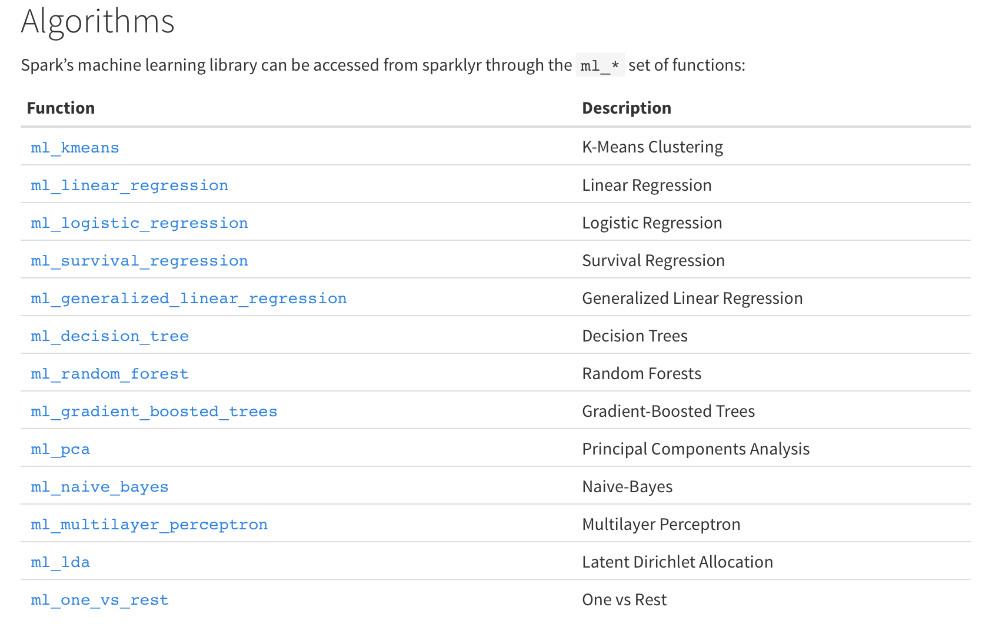

------


This notebook is available on:
https://github.com/epspi/02.28.2017_Cin-Day_RUG_sparklyr

The data is available at census.gov:
https://www.census.gov/econ/cfs/pums.html

A fully instructive tutorial is at:
http://spark.rstudio.com/


## Installation & Connection
`sparklyr` and `dplyr` is what we'll be using. Install Spark directly from R with the handy `spark_install()` function within `sparklyr`
```{r Setup}
if (!require(dplyr)) install.packages("dplyr")
if (!require(data.table)) install.packages("data.table")
if (!require(sparklyr)) install.packages("sparklyr")

library(dplyr)
library(data.table)
library(sparklyr)

# spark_install(version = "2.0.1")
# spark_install(version = "1.6.2")
```


```{r Connection}
sc <- spark_connect(master = "local", version = "2.0.1")

# If you have port conflicts, try:
# config <- spark_config()
# config$sparklyr.gateway.port <-  5454
# sc <- spark_connect(master = "local", config = config)

sc
src_tbls(sc)
spark_web(sc)
```


## Importing Data
We need to feed data into the Spark cluster, whether by copying it from R objects or by using one of the filereader functions.  

#### copy_to
```{r}
# Read in the text file locally and then copy_to Spark
system.time({
    ship <- fread("data/cfs_2012_pumf_csv.txt")
    ship_sp <- copy_to(sc, ship, "ship", overwrite = T)
})
# src_tbls(sc)

```
  
  
There are (at least) three readers for getting data *directly* into the cluster: 

* `spark_read_csv`
* `spark_read_parquet`
* `spark_read_json`


#### spark_read_csv
```{r}
system.time(
    ship2_sp <- spark_read_csv(sc, "ship2", 
                           "data/cfs_2012_pumf_csv.txt")
)
```

We can't use `names` to figure out what's in the spark tables,
but `colnames` and `tbl_vars` work
```{r}
# colnames(ship_sp)
tbl_vars(ship2_sp)
```

The RStudio table viewer also works on Spark tables
```{r}
head(ship2_sp) %>% View
```

## Manipulating Data with dplyr

You can use **some** (all?) of the dplyr verbs and also SQL commands directly on spark tables. That's basically the whole point.

```{r}
ship2_sp %>% count(ORIG_STATE)
```

Spark will defer calculation until you deliberately or implictely try to `collect` the data back as an R object. 

```{r}
head(ship2_sp)
spark_log(sc, n = 3)
```

For example, we select some columns of interest and assign the resulting df to a new variables. However, as we see by calling `names` or `str` on the resulting variable, it's still a spark object, not a **collected** df.
```{r}
ship_values <- ship2_sp %>% 
    select(contains("SHIPMT"))

names(ship_values)
```

Once we ask for the contents of `ship_values`, however, an implicit collection occurs
```{r}
ship_values %>% head
```

## Machine Learning

The `sparklyr` API includes interfaces to way more `Spark ML` facilities than the previous API from Spark directly.




### Regression Example

Let's try running a simple linear regression of shipment values of some other numeric variables


```{r}
system.time({
    lm_sp <- ship_values %>% 
    select(-SHIPMT_ID) %>% 
    ml_linear_regression(SHIPMT_VALUE ~ .)
})
```

```{r}
system.time({
    dat <- ship %>% 
    select(contains("SHIPMT")) %>% 
    select(-SHIPMT_ID)

lm_R <- lm(SHIPMT_VALUE ~ ., data = dat)
})
    
```

The output of the Spark linear regression is an object of a different type than the usual `lm` class.
```{r}
class(lm_sp)
class(lm_R)
```


```{r}
cat("\nSpark LM Summary Output\n")
summary(lm_sp)

cat("\n\nR LM Summary Output\n")
summary(lm_R)
```

The Spark machine learning output object has basically all the same values as the equivalent R object
```{r}
names(lm_sp)
```

One difference is that the Spark output does not contain the original data (for good reason!), which means that there is no `plot` method defined on the object.
```{r}
# DOES NOT WORK!
#plot(lm_sp)

# Works but may crash anyways due to size
#plot(lm_R)
```


## More Involved Regression Example

Let's split the dataset according to origin state (`ORIG_STATE`) and fit a linear model to each subset.

### Regular R
```{r}
system.time({
    stateModelsR <- ship %>% 
        select(ORIG_STATE, contains("SHIPMT"), -SHIPMT_ID) %>% 
        by(., .$ORIG_STATE, . %>% {
            lm(SHIPMT_VALUE ~ . - ORIG_STATE, data = .)
        })
})

stateModelsR
```

### Spark
First, we cache the spark RDD 
```{r}
# Cache Spark table to memory 
# (may already be cached after spark_read_csv)
tbl_cache(sc, "ship2")
```

Replicating the form we used above won't work for Spark, because `by` doesn't work. Trust me, it will break the backend and you'll have to restart. The next candidate is `group_by` with `do`, made available in Jan 2017 with the release of *sparklyr 0.5*.
https://blog.rstudio.org/2017/01/24/sparklyr-0-5/
```{r}
system.time({
    stateModelsSp <- ship2_sp %>% 
        select(ORIG_STATE, contains("SHIPMT"), -SHIPMT_ID) %>% 
        group_by(ORIG_STATE) %>% 
        do(mod = ml_linear_regression(
            SHIPMT_VALUE ~ . - ORIG_STATE, data = .)
        )
})
```

The resulting object is a data frame with a column identifying our origin states and a second column containing a pointer to the actual models
```{r}
stateModelsSp
```

```{r}
stateModelsSp$mod

```

